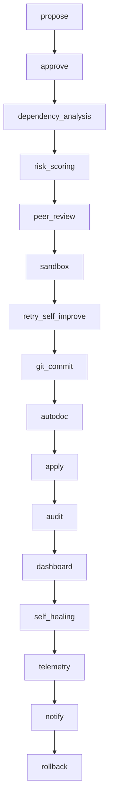

# SelfModifyingAgent — الدليل الاحترافي الشامل

---

## 🚀 ما هو SelfModifyingAgent؟

طبقة تطوير ذاتي آمنة وذكية لأي نموذج أو نظام Python.  
تمكّنك من اقتراح وتطبيق تعديلات (parameters أو كود أو وحدات)، اختبارها آليًا، تقييم المخاطر، المراجعة الافتراضية، دمجها في Git، التراجع الذاتي، مراقبة صحة النظام، وتوليد وثائق تلقائية — كل ذلك بدون تدخل بشري مباشر.

---

## 🧩 المكونات الأساسية — Overview

- **اقتراح تعديل/وحدة جديدة:** (`propose_update`, `propose_new_module`)
- **موافقات متعددة:** (`approve_update`)
- **Sandbox متعدد:** اختبار آمن لكل تعديل (فردي، دفعات، أو Quantum).
- **تحليل الاعتماديات:** كشف العلاقات والتأثيرات داخل الكود.
- **تقييم المخاطر الذكي:** تقييم تلقائي لكل تعديل بناء على تاريخه وسجله.
- **دورة تحسين تلقائي (self-retry):** إذا فشل التعديل، يحاول تحسينه بالذكاء الاصطناعي.
- **مراجعة افتراضية:** تحليل ذكي لكل تعديل (heuristic + LLM-ready).
- **أمان تنبؤي:** فحص أمان متقدم، جاهز للربط مع LLM.
- **توليد وثائق تلقائي:** مقارنة قبل/بعد التغيير وتوليد doc تلقائي.
- **Dashboard hooks:** تصدير snapshot لحالة النظام لأي لوحة مراقبة.
- **عزل sandbox متقدم:** snapshot، limits للموارد، قابل للتوسع لنظام ملفات وهمي.
- **تراجع ذاتي:** rollback لأي تعديل عند اكتشاف خطأ متأخر.
- **Telemetry خصوصي:** تتبع الأداء مع حماية الخصوصية.
- **تكامل Git احترافي:** دعم branch/commit/push مع محاكاة PR.
- **سجل مركزي:** كل خطوة محفوظة مع version/hash/timestamp.
- **قابلية التطوير:** كل وحدة قابلة للتخصيص أو التبديل.

---

## ⚡ دورة حياة التعديل (Full Lifecycle)



**شرح الخطوات:**

1. **propose:** اقتراح تعديل أو إضافة وحدة.
2. **approve:** جمع الموافقات المطلوبة.
3. **dependency_analysis:** تحليل تأثير التعديل على بقية النظام.
4. **risk_scoring:** تقييم ذكي لمخاطر التعديل.
5. **peer_review:** مراجعة افتراضية (Meta-Agent).
6. **sandbox:** تجربة آمنة للتعديل (فردي/دفعة/quantum).
7. **retry_self_improve:** محاولة تحسين التعديل تلقائيًا في حال الفشل (LLM Feedback).
8. **git_commit:** إنشاء فرع/commit/PR تجريبي.
9. **autodoc:** توليد وثائق تلقائية (diff/summary).
10. **apply:** تطبيق التعديل فعليًا.
11. **audit:** تسجيل كل خطوة في السجل المركزي.
12. **dashboard:** تحديث لوحة التحكم أو ملف snapshot.
13. **self_healing:** مراقبة صحة النظام والتراجع الذاتي في حال ظهور مشاكل.
14. **telemetry:** إرسال مقاييس أداء مع حماية الخصوصية.
15. **notify:** إشعار المستخدم أو النظام بأي حدث مهم.
16. **rollback:** التراجع الذاتي عند الحاجة.

---

## 🛠️ أمثلة عملية — Practical Examples

### 1️⃣ تعديل معلمة داخلية بأمان وذكاء

```python
from services.model.self_modifying_agent import SelfModifyingAgent

class Model:
    lr = 0.1

model = Model()
agent = SelfModifyingAgent(model, repo_path=".", enable_dashboard=True, enable_dp_telemetry=True)

# اقتراح تعديل يتطلب موافقتين
update_id = agent.propose_update("lr", 0.15, reason="تحسين الأداء", required_approvals=2)

agent.approve_update(update_id)
agent.approve_update(update_id)

# تجربة دفعة تعديلات (batch) وتطبيق الأفضل:
agent.apply_best_pending_batch()

# مراجعة السجل
for change in agent.audit_trail():
    print(change)
```

---

### 2️⃣ إضافة وحدة جديدة مع مراجعة افتراضية وتقييم مخاطرة

```python
new_code = '''
class DynamicTool:
    def run(self):
        return "عمل ديناميكي!"
'''
code_path = "services/model/dynamic_tool.py"
update_id = agent.propose_new_module(
    code=new_code,
    code_path=code_path,
    reason="إضافة أداة ديناميكية جديدة",
    required_approvals=2
)

agent.approve_update(update_id)
agent.approve_update(update_id)
# تطبيق التعديلات مع self-retry وauto-doc
agent.apply_pending_updates()
```

---

### 3️⃣ تجربة Quantum Sandbox (عدة متغيرات/patches واختيار الأفضل)

```python
mutators = [
    lambda code: code.replace("return", "print('debug'); return"),
    lambda code: code + "\n# تجربة تعليق تلقائي"
]
quantum = agent.quantum_sim
results = quantum.simulate(
    code_path="services/model/dynamic_tool.py",
    base_code=new_code,
    test_cmd=["pytest", "-q"]
)
# اختيار أفضل patch
best = results[0]
print("أفضل كود:", best["code"])
```

---

### 4️⃣ مراقبة صحة النظام والتراجع الذاتي (Self-Healing Rollback)

```python
def health_check():
    # مثال: جلب نسبة الخطأ من logs/metrics
    return {"error_rate": 0.04}
agent.set_self_heal(health_check, window=60, threshold=0.05)

# بعد أي apply، إذا زادت نسبة الخطأ بعد دقيقة، يتم rollback تلقائي!
```

---

## 🔒 أمان متقدم وتقييم مخاطرة

- **adaptive_type_check:** يسمح فقط بتحويلات آمنة (numeric، str<->number)، ويرفض التحويلات البنيوية أو يطلب موافقة بشرية.
- **PredictiveSecurityChecker:** يفحص الكود عبر heuristics وقابل للربط مع LLM.
- **VirtualPeerReviewer:** مراجعة افتراضية قبل التطبيق لكل تعديل (خاصة عالية المخاطر).
- **RiskScorer:** تقييم مخاطرة ديناميكي بناءً على السجل والأداء السابق.
- **code_is_safe:** فحص استباقي لأي محاولة تنفيذ أوامر خطرة.

---

## 📈 مراقبة الأداء والخصوصية (Dashboard/Telemetry)

- **DashboardHooks:** تصدير snapshot لأي حالة إلى ملف JSON أو push hook لأي dashboard خارجي.
- **DPTelemetry:** تتبع كل مقاييس الأداء الرئيسية مع حماية الخصوصية (Laplace noise).
- **AutoDocGenerator:** لكل تعديل، توليد وثيقة diff وملخص تلقائي.

---

## 🏆 معايير القبول (Acceptance Criteria)

- أي تعديل يجب أن يمر بكامل دورة الحياة (propose → approve → dependency → risk → review → sandbox → retry → git → doc → apply → audit → dashboard → telemetry → rollback).
- رفض تلقائي لأي محاولة تعديل حقل حساس.
- sandbox وbatch/quantum مدعومة بالكامل.
- self-retry (LLM feedback) عند الفشل.
- rollback ذاتي عند اكتشاف مشاكل بعد التطبيق.
- إشعارات لأي حدث مهم.
- كل شيء موثق في السجل المركزي.
- Telemetry خاص وآمن.
- توافق تام مع الأنظمة البرمجية والاختبارية.
- قابلية التخصيص والتوسعة لأي نظام ذكاء اصطناعي.

---

## 🧠 كيف تدمج مع ذكاء اصطناعي أكبر؟

- يمكن ربط LLMAdapter بأي خدمة GPT/Claude/OpenSource.
- hooks لكل مرحلة: (قبل/بعد sandbox، قبل/بعد git، بعد كل apply).
- كل وحدة قابلة للتبديل أو التخصيص لأي تجربة بحثية أو إنتاجية متقدمة.

---

## 📝 نصائح متقدمة

- للمشاريع الكبيرة، استخدم batch sandbox لتجربة دفعات وتحسين الأداء.
- اربط DashboardHooks بأي نظام مراقبة خارجي (websocket, grafana...).
- استخرج بيانات الاعتماديات لتقليل المخاطر عند تجربة تعديلات معقدة.
- فعّل self-healing rollback في الأنظمة الحرجة.
- استخدم DPTelemetry إذا كان فريقك يهتم بالخصوصية القصوى.

---

## 🏁 الخلاصة

SelfModifyingAgent الآن هو أقوى طبقة تطوير ذاتي آمنة واحترافية لأي مشروع Python/AI.  
يدعم كل دورة الحياة الذكية لأي تحديث، مع أمان وشفافية غير مسبوقة، وقابلية توسعة لأي بيئة ذكاء اصطناعي أو إنتاج برمجيات.

---